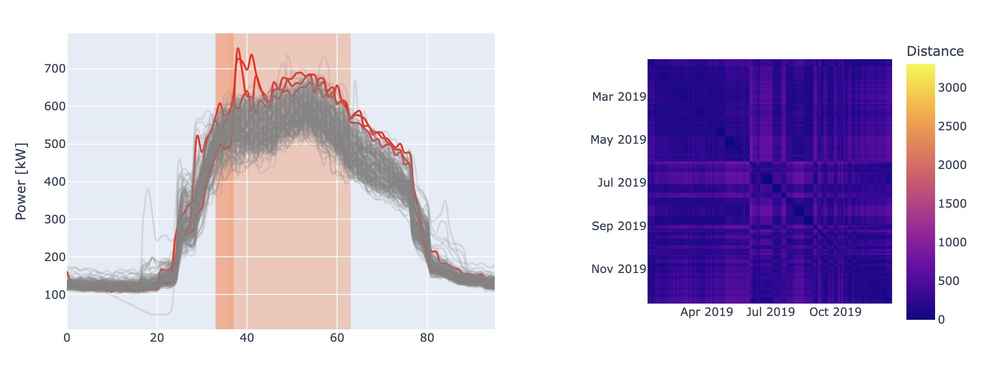

# Contextual Matrix Profile Calculation Tool

The Matrix Profile has the potential to revolutionize time series data mining because of its generality, versatility,
simplicity and scalability. In particular it has implications for time series motif discovery, time series joins,
shapelet discovery (classification), density estimation, semantic segmentation, visualization, rule discovery,
clustering etc.



**Table of Contents**

* [Usage](#usage)
    * [Data format](#data-format)
    * [Run locally](#run-locally)
    * [Run with Docker](#run-with-docker)
* [Additional Information](#additional-information)
* [Cite](#cite)
* [Contributors](#contributors)
* [License](#license)

## Usage

The tool comes with a cli that helps you to execute the script with the desired commands

```console 
$ python -m src.cmp.main -h

Matrix profile

positional arguments:
  input_file     Path to file
  variable_name  Variable name
  output_file    Path to the output file

options:
  -h, --help     show this help message and exit
```

The arguments to pass to the script are the following:

* `input_file`: The input dataset via an HTTP URL. The tool should then download the dataset from that URL; since it's a
  presigned URL, the tool would not need to deal with authentication—it can just download the dataset directly.
* `variable_name`: The variable name to be used for the analysis (i.e., the column of the csv that contains the
  electrical load under analysis).
* `output_file`: The local path to the output HTML report. The platform would then get that HTML report and upload it to
  the object
  storage service for the user to review later.

You can run the main script through the console using either local files or download data from an external url. This
repository comes with a sample dataset (data.csv) that you can use to generate a report and you can pass the local path
as `input_file` argument as follows:

### Data format

todo

### Run locally

Create virtual environment and activate it and install dependencies:

- Makefile
  ```bash
  make setup
  ```
- Linux:
  ```bash
  python3 -m venv .venv
  source .venv/bin/activate
  pip install poetry
  poetry install
  ```
- Windows:
  ```bash
  python -m venv venv
  venv\Scripts\activate
  pip install poetry
  poetry install
  ```

Now you can run the script from the console by passing the desired arguments. In the following we pass the sample
dataset [`data.csv`](src/cmp/data/data.csv) as input file and the variable `Total_Power` as the variable name to be used
for the analysis. The output file will be saved in the [`results`](src/cmp/results) folder.

```console
$ python -m src.cmp.main src/cmp/data/data.csv Total_Power src/cmp/results/reports/report.html

2024-08-13 12:45:42,821 [INFO](src.cmp.utils) ⬇️ Downloading file from <src/cmp/data/data.csv>
2024-08-13 12:45:43,070 [INFO](src.cmp.utils) 📊 Data processed successfully

*********************
CONTEXT 1 : Subsequences of 05:45 h (m = 23) that start in [00:00,01:00) (ctx_from00_00_to01_00_m05_45)
99.997%        0.0 sec

- Cluster 1 (1.660 s)   -> 1 anomalies
- Cluster 2 (0.372 s)   -> 3 anomalies
- Cluster 3 (0.389 s)   -> 4 anomalies
- Cluster 4 (0.593 s)   -> 5 anomalies
- Cluster 5 (-)         -> no anomalies green

[...]

2024-08-13 12:46:27,187 [INFO](__main__) TOTAL 0 min 44 s
2024-08-13 12:46:32,349 [INFO](src.cmp.utils) 🎉 Report generated successfully on src/cmp/results/reports/report.html

```

At the end of the execution you can find the report in the path specified by the `output_file` argument, in this case
you will find it in the [`results`](src/cmp/results) folder.

### Run with Docker

Build the docker image.

- Makefile
  ```bash
  make docker-build
  ```
- Linux:
  ```bash
  docker build -t cmp .
  ```

Run the docker image with the same arguments as before

- Makefile
  ```bash
  make docker-run
  ```
- Linux:
  ```bash
  docker run cmp data/data.csv Total_Power results/reports/report.html
  ```

At the end of the execution you can find the results in the [`results`](src/cmp/results) folder inside the docker
container.

## Additional Information

```
# 2) User Defined Context
# We want to find all the subsequences that start from 00:00 to 02:00 (2 hours) and covers the whole day
# In order to avoid overlapping we define the window length as the whole day of
# observation minus the context length.

# - Beginning of the context 00:00 AM [hours]
context_start = 17

# - End of the context 02:00 AM [hours]
context_end = 19

# - Context time window length 2 [hours]
m_context = context_end - context_start  # 2

# - Time window length [observations]
# m = 96 [observations] - 4 [observation/hour] * 2 [hours] = 88 [observations] = 22 [hours]
# m = obs_per_day - obs_per_hour * m_context
m = 20  # with guess

# Context Definition:
# example FROM 00:00 to 02:00
# - m_context = 2 [hours]
# - obs_per_hour = 4 [observations/hour]
# - context_start = 0 [hours]
# - context_end = context_start + m_context = 0 [hours] + 2 [hours] = 2 [hours]
contexts = GeneralStaticManager([
    range(
        # FROM  [observations]  = x * 96 [observations] + 0 [hour] * 4 [observation/hour]
        (x * obs_per_day) + context_start * obs_per_hour,
        # TO    [observations]  = x * 96 [observations] + (0 [hour] + 2 [hour]) * 4 [observation/hour]
        (x * obs_per_day) + (context_start + m_context) * obs_per_hour)
    for x in range(len(data) // obs_per_day)
])
```

## Cite

You can cite this work by using the following reference or either though [this Bibtex file](./docs/ref.bib) or the
following plain text citation

> Chiosa, Roberto, et al. "Towards a self-tuned data analytics-based process for an automatic context-aware detection
> and
> diagnosis of anomalies in building energy consumption timeseries." Energy and Buildings 270 (2022): 112302.

## Contributors

- [Roberto Chiosa](https://github.com/RobertoChiosa)

## License

This code is licensed under the MIT License - see the [LICENSE](LICENSE.md) file for details.
